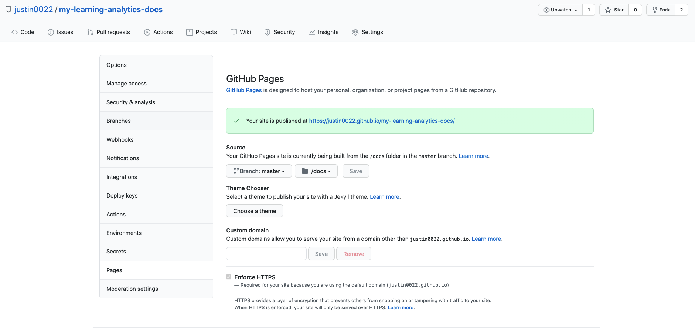

# My Learning Analytics Documentation
Host your own version of My Learning Analytics documentation, with your own university branding and contact information.

## Getting Started
These instructions will get you a copy of the documentation up and running, with optional free hosting by [Github Pages](https://pages.github.com/).

### Prerequisites
1. **Install [Node 8.0.0 or greater](https://nodejs.org)**.

### Building and hosting
1. Fork this repository.
1. Clone the forked repository.
1. Under `assets/template`, replace the existing `index.html` and `css/unit.css` with your university's web branding. You'll need to keep the HTML file named `index.html`. In this HTML file, you'll need to add a `

`, which is where the documentation will be attached.
1. Run `node convertMD.js`. This outputs the static files under `/docs`.
1. Everything within `/docs` will be published by Github Pages.
1. On Github, open the repository settings, and click on `Pages`.
  
1. Under `Source`, change `/root` to `/docs`, and click save.
1. If you have a custom domain, set it here.
1. Commit/push your changes. Soon your documentation should be published at the URL linked on this page.

## Authors

* [justin0022](https://github.com/justin0022) -
**Justin Lee** &lt;justin.lee@ubc.ca&gt;

## License

This project is licensed under the GNU General Public License v3.0.